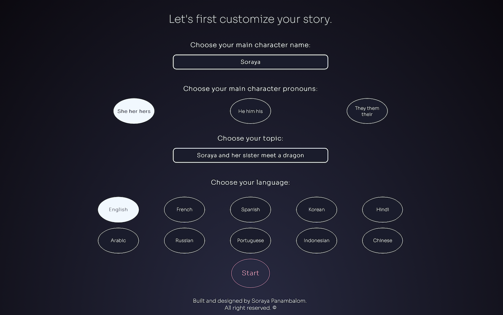

# Tell Me a Story AI by Soraya PANAMBALOM

Tell Me a Story AI is a web game application that allows users to generate personalized stories using artificial intelligence thanks to the Open AI API.
In this application you will be able to create an account and play with the AI story tellers to create your own unique stories.

## Getting Started

1. Install the project dependencies:

                cd tell-me-a-story-ai
                npm install

2. Create a .env file in the server folder and paste your own Open AI API key.

3. In the "server" folder run 

                   node index.js

4. In the "client" folder run

                    npm run dev

5. Navigate to `http://localhost:5173` to display the application. 

## Database Setup

This project uses MongoDB as the database for storing user data. To set up the database for this project, follow these steps:

1. **MongoDB Installation**: If you haven't already installed MongoDB, you can download it from the [official MongoDB website](https://www.mongodb.com/try/download/community).

2. **Configuration File**: In the "server" folder, locate the "index.js" file. Open this file and find the following line:

            mongoose.connect("mongodb://localhost:27017/user-story-teller", {
                        useNewUrlParser: true,
                        useUnifiedTopology: true
            });

Replace "mongodb://localhost:27017/user-story-teller" with your own database.

## Usage

- Create an account and log in.
- Choose your story teller.
- Customize your story by entering the main character's name, pronouns, topic, and language.
- Interact with the AI storyteller in the chat interface.
- Enjoy personalized stories generated by the AI.

## Acknowledgments

Thanks to OpenAI for their GPT-3 turbo model, which powers the storytelling AI.

## License

This project is licensed under the [Creative Commons Attribution 4.0 International License (CC BY 4.0)](LICENSE.md). 

For details, please see the [LICENSE.md](LICENSE.md) file.

Copyright © 2023 Soraya PANAMBALOM All rights reserved.

The images inside the assets folder are a property of Soraya PANAMBALOM and are protected by copyright and should not be reused or redistributed without permission.
